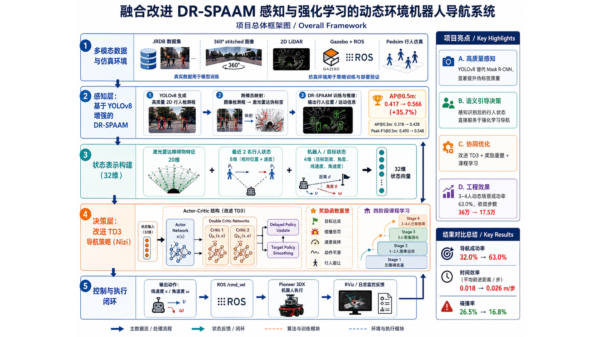
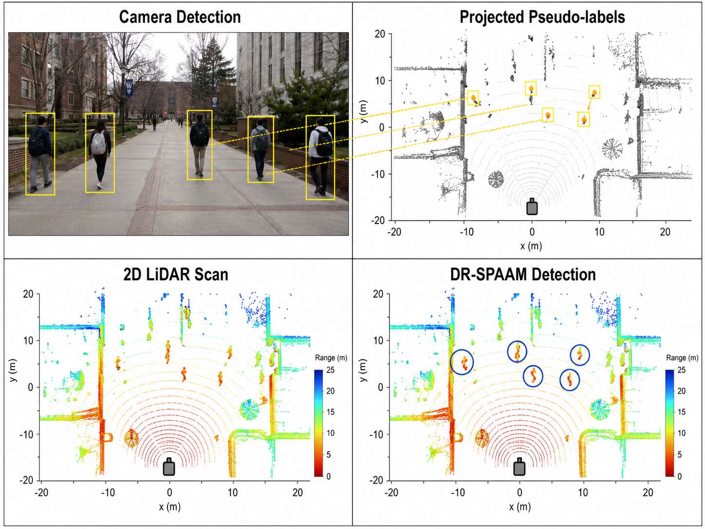
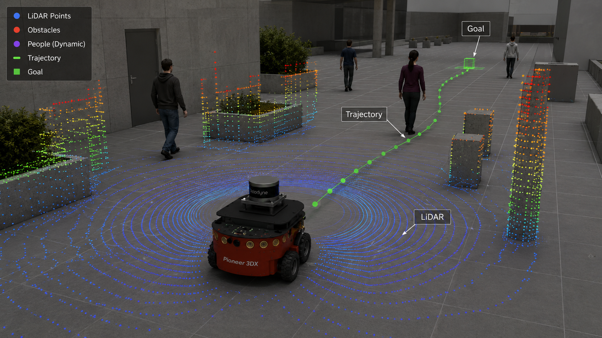

# lidar-pedestrian-navigation

2D LiDAR-based pedestrian detection and robot navigation in ROS/Gazebo.

This repository collects the code and experiment assets for a course/research project on mobile robot navigation in pedestrian-rich environments. The project combines:

- a DR-SPAAM-style 2D LiDAR pedestrian detector trained with camera-based pseudo labels, and
- a TD3 reinforcement learning navigation baseline running in a ROS/Gazebo Pioneer 3DX simulation with a Velodyne sensor.

The project report describes the full research motivation, method design, and experimental results:

[Project Report](./docs/report.pdf)



## Overview

Robots moving through dynamic pedestrian environments need both reliable perception and robust decision making. This repository is organized around two connected themes:

1. Perception: improve 2D LiDAR pedestrian detection by replacing or complementing Mask R-CNN pseudo labels with YOLOv8 detections on JRDB camera images, then projecting visual detections into LiDAR supervision for DR-SPAAM training.
2. Navigation: use TD3 to learn continuous linear and angular velocity commands for a Pioneer 3DX robot in ROS/Gazebo from LiDAR observations and goal-relative state.

The report discusses a broader end-to-end design in which semantic pedestrian information from perception is used to improve dynamic navigation. The current source tree should be read as a reproducible code base for the perception experiments plus a ROS/Gazebo TD3 navigation baseline, with integration notes and assets for the combined project.

## Repository Structure

```text
.
├── Perception/                 # YOLOv8-enhanced DR-SPAAM perception module
│   ├── bin/                    # Dataset setup, YOLOv8 detections, fusion, training, comparison
│   ├── cfgs/                   # DR-SPAAM configs for Mask R-CNN, YOLOv8, and fused pseudo labels
│   ├── dr_spaam/               # Dataset handles, models, detector wrapper, training pipeline
│   ├── scripts/                # Batch experiment scripts
│   ├── tests/                  # Development and visualization tests
│   └── README.md
├── RL-robot-navigation/         # TD3 navigation baseline and ROS/Gazebo workspace
│   ├── TD3/                    # TD3 actor/critic, replay buffer, Gazebo environment
│   └── catkin_ws/src/          # Pioneer 3DX scenario and Velodyne simulator packages
├── assets/                     # Project figures used by README/report
└── docs/report.pdf             # Project report
```

## Key Components

### Perception: YOLOv8-enhanced DR-SPAAM

The perception module adapts a DR-SPAAM-style 2D LiDAR pedestrian detection pipeline for JRDB-style data. It adds:

- YOLOv8 person detection on stitched JRDB camera images.
- Mask R-CNN, YOLOv8, and fused pseudo-label comparison.
- Camera-to-LiDAR pseudo-label generation using projected LiDAR points.
- DR-SPAAM training and evaluation configs for each pseudo-label source.

Reported in the project report, AP@0.5m improves from 0.417 to 0.566 when using the improved pseudo-label strategy.



### Navigation: TD3 in ROS/Gazebo

The navigation module is based on a TD3 mobile robot navigation implementation. It trains a Pioneer 3DX robot in Gazebo using:

- 20 angular bins from simulated Velodyne point cloud distances.
- 4 robot/goal features: goal distance, goal heading, linear velocity, angular velocity.
- 2 continuous actions mapped to `/r1/cmd_vel`.
- Twin critics, delayed policy updates, target action smoothing, replay buffer training, and exploration noise decay.

The current checked-in TD3 code uses a 24-dimensional state (`20` LiDAR bins + `4` robot/goal features). The richer report-level design with explicit dynamic pedestrian features and staged curriculum learning is documented in the report, but is not fully represented as a standalone checked-in decision module in this repository.



## Installation

The two modules have different runtime environments. The perception module is Python/PyTorch based. The navigation module requires ROS Noetic and Gazebo.

### Perception Environment

From the repository root:

```bash
cd Perception
python -m venv .venv
source .venv/bin/activate
pip install -r requirements.txt
pip install -e .
```

For CUDA acceleration, install a PyTorch build that matches your CUDA toolkit before installing the remaining requirements.

External assets are not included in the repository:

- JRDB dataset: place or symlink it at `Perception/data/JRDB`.
- YOLOv8 weights, such as `yolov8x.pt`: download separately and pass the path with `--model`.
- DR-SPAAM checkpoints and full training logs: provide locally if you want to run detector tests or resume experiments.

### ROS/Gazebo Environment

The navigation code was tested upstream with ROS Noetic, Ubuntu 20.04, Python 3.8, PyTorch, TensorBoard, and Gazebo.

```bash
cd RL-robot-navigation/catkin_ws
catkin_make_isolated
source devel_isolated/setup.bash
```

Set ROS/Gazebo environment variables before launching training:

```bash
export ROS_HOSTNAME=localhost
export ROS_MASTER_URI=http://localhost:11311
export ROS_PORT_SIM=11311
export GAZEBO_RESOURCE_PATH=$PWD/src/multi_robot_scenario/launch
```

## Usage

### 1. Prepare JRDB Data

```bash
cd Perception
python bin/setup_jrdb_dataset_v2.py --split train
```

The setup script extracts laser scans from JRDB rosbags and writes synchronized `frames_pc_im_laser.json` files. If laser files already exist, use:

```bash
python bin/setup_jrdb_dataset_v2.py --split train --skip_laser
```

### 2. Generate YOLOv8 Detections

```bash
python bin/generate_yolov8_detections.py \
    --data_dir ./data/JRDB \
    --split train \
    --model ./yolov8x.pt \
    --device cuda
```

This writes JRDB-style detection JSON files under:

```text
data/JRDB/train_dataset/detections/detections_2d_stitched_yolov8/
```

### 3. Fuse Mask R-CNN and YOLOv8 Detections

```bash
python bin/fuse_detections.py \
    --data_dir ./data/JRDB \
    --split train \
    --iou_thresh 0.5 \
    --min_conf 0.3
```

The fused outputs are written to:

```text
data/JRDB/train_dataset/detections/detections_2d_stitched_fused/
```

### 4. Train DR-SPAAM with Pseudo Labels

```bash
python bin/train.py --cfg cfgs/dr_spaam_jrdb_maskrcnn_pseudo.yaml
python bin/train.py --cfg cfgs/dr_spaam_jrdb_yolov8_pseudo.yaml
python bin/train.py --cfg cfgs/dr_spaam_jrdb_fused_pseudo.yaml
```

Or run the comparison script:

```bash
bash scripts/run_comparison_experiments.sh
```

### 5. Compare Detector Outputs

```bash
python bin/compare_detectors.py \
    --data_dir ./data/JRDB \
    --split train \
    --output_dir ./comparison_results
```

### 6. Train or Test the TD3 Navigation Baseline

```bash
cd RL-robot-navigation/TD3
python3 train_velodyne_td3.py
```

Monitor training with TensorBoard:

```bash
tensorboard --logdir runs
```

After a policy has been saved under `pytorch_models/`, test it with:

```bash
python3 test_velodyne_td3.py
```

Note: the TD3 scripts currently expect a launch file named `multi_robot_scenario.launch` under `RL-robot-navigation/TD3/assets/`, while the checked-in ROS launch files are under `RL-robot-navigation/catkin_ws/src/multi_robot_scenario/launch/`. Create or adjust the launch path before running the scripts.

## Results Summary

The project report presents the following headline results:

- LiDAR pedestrian detection AP@0.5m: `0.417 -> 0.566`.
- Improved pseudo-label quality through YOLOv8 and fused detector supervision.
- TD3-based navigation experiments in increasingly difficult dynamic scenarios.
- Final reported dense-scenario navigation success rate: `63.0%`.

Because datasets, model weights, checkpoints, and complete experiment logs are not included, these numbers should be treated as report results rather than values automatically reproduced by a fresh clone.

## Known Limitations

- JRDB data, YOLOv8 weights, pretrained checkpoints, and training logs are not included.
- The perception and navigation modules are not wired into a single executable end-to-end ROS pipeline in the current source tree.
- The checked-in TD3 implementation uses a 24-dimensional LiDAR plus goal state, not the full report-level semantic pedestrian state.
- The navigation launch path needs to be adjusted before running TD3 training/testing from `RL-robot-navigation/TD3`.
- Some perception utilities depend on JRDB-specific directory layouts and ROS bag-reading dependencies.

## References and Acknowledgements

This repository builds on:

- DR-SPAAM/DROW-style 2D LiDAR pedestrian detection code and methodology.
- YOLOv8 from Ultralytics for camera-based pedestrian detections.
- The TD3 ROS/Gazebo mobile robot navigation implementation in `RL-robot-navigation`.
- The Velodyne Gazebo simulator packages included under the ROS workspace.

Please also consult module-level READMEs for more detailed setup notes:

- [Perception README](./Perception/README.md)
- [RL-robot-navigation README](./RL-robot-navigation/README.md)

## Keywords

Robot perception, pedestrian detection, 2D LiDAR, DR-SPAAM, YOLOv8, pseudo labels, dynamic robot navigation, reinforcement learning, TD3, ROS, Gazebo.
